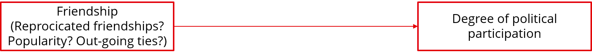
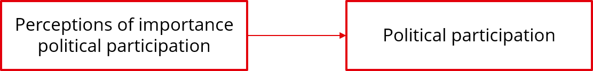
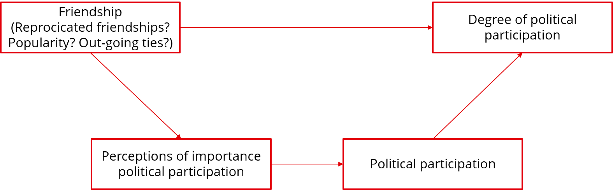

# Preparation before class

## Article 1

**Service, activism and friendships in high school: A longitudinal
social network analysis of peer influence and critical beliefs – Wegemer
(2022)**

[Main question]{.underline}: To what extent do peer influence and
perceptions of inequities promote civic behaviour at a predominantly
low-income Latinx high school?

[Main concepts]{.underline}:

\- Service: Volunteering, organising charitable events and participating
in the student government

\- Activism: Participating in direct actions, campaigning for issues,
and involvement in social justice groups

\- Perceptions of inequities: Whether students believe that members of
certain ethnic groups, people in poverty, women or LGBTQIA+ people have
fewer chances to get ahead in society

[Hypotheses:]{.underline}

1\. Students’ service, activism and perceptions of inequities become
more similar to the average level of their friends (socialisation
effect)

2\. This socialisation effect is greater for service than for activism
and perceptions of inequities

3\. Students’ perceptions of inequities predict increased participation
in activism over time, and vice versa (participation in activism predict
increased perceptions of inequities)

4\. There is no relation between perceptions of inequities and service
behaviour

[Data:]{.underline}

\- A survey of all students enrolled at a southern Californian high
school (socionet), at two time points: March 2019 and March 2020

\- Sample: All students who were enrolled (N = 354) and completed the
survey in both years (N = 272, 72%)

\- Network data: o Each respondent was asked to provide the first and
last names of their five closest friends at the high school

[Analysis method:]{.underline}

\- A stochastic actor based model (SABM), using RSiena

[Results]{.underline}:

1\. Students’ service, activism and perceptions of inequities become
more similar to the average level of their friends (socialisation
effect)

\- Evidence for civic socialisation for service actions, but not for
activism and perceptions of inequities

2\. This socialisation effect is greater for service than for activism
and perceptions of inequities

\- There is no effect of activism and perceptions of inequities

3\. Students’ perceptions of inequities predict increased participation
in activism over time, and vice versa (participation in activism predict
increased perceptions of inequities)

\- Perceptions of inequities do increase participation in activism, the
effect the other way around is not found

4\. There is no relation between perceptions of inequities and service
behaviour

\- Service and activism do not predict each other

## Article 2

**Civic development within the peer context: Associations between early
adolescent social connectedness and civic engagement – Oosterhoff et al
(2021)**

[Main question]{.underline}: How is social connectedness associated with
civic engagement among early adolescents? How does this relationship
differ across gender and grade?

[Main concepts]{.underline}:

\- Different elements of civic engagement are measured separately:

- Volunteering

- Political engagement

- Environmentalism

- Civic efficacy

- Social responsibility values

\- Social connectedness:

- Popularity, active, reciprocity, connections to multiple peer groups,
  more popular friends

[Hypotheses:]{.underline}

1\. Youth who are more socially connected, have higher levels of civic
engagement

2\. Social connectedness is more strongly associated with volunteering
and social responsibility for girls than for boys

3\. Social connectedness is more strongly associated with political
engagement for boys than for girls

4\. Social connectedness is more strongly associated with civic
engagement for older youth than for younger youth

[Data]{.underline}:

\- A survey of all students in 6th through 8th grade from a middle
school in the northwestern US

\- Sample: All 250 students, of which 213 (85%) actually participated

\- Network data:

- Each respondent could identify up to 7 people with whom they spend the
  most time by selecting the names from a pre-set list

- After selecting, for each person they were asked to rate how much they
  like spending time with that person

[Analysis]{.underline}:

\- Regression analyses, using the package suite in R

[Results]{.underline}:

1\. Youth who are more socially connected, have higher levels of civic
engagement

- Active youths have a higher civic efficacy; Popularity, reciprocity,
  betweenness and eigenvector were not related to civic efficacy

- No measure of social connectedness is related to volunteering,
  environmentalism or social responsibility values

- Youths with lower betweenness and eigenvector are more engaged in
  political behaviour

2\. Social connectedness is more strongly associated with volunteering
and social responsibility for girls than for boys

- Is not found

3\. Social connectedness is more strongly associated with political
engagement for boys than for girls

- Greater popularity is associated with higher political engagement for
  boys, but not for girls

4\. Social connectedness is more strongly associated with civic
engagement for older youth than for younger youth

- The association between betweenness and environmentalism is stronger
  for grade 6th than for grade 7 and 8

## My own topic

[Macro, descriptive question:]{.underline}

Does positive peer influence affect youths’ political participation
behaviour?

[Micro, explanatory question:]{.underline}

Why does positive peer influence affect youths’ political participation
/ is there positive influence in friendship groups, where peers become
more similar to each other with regards to the degree of political
participation?

Put together:

