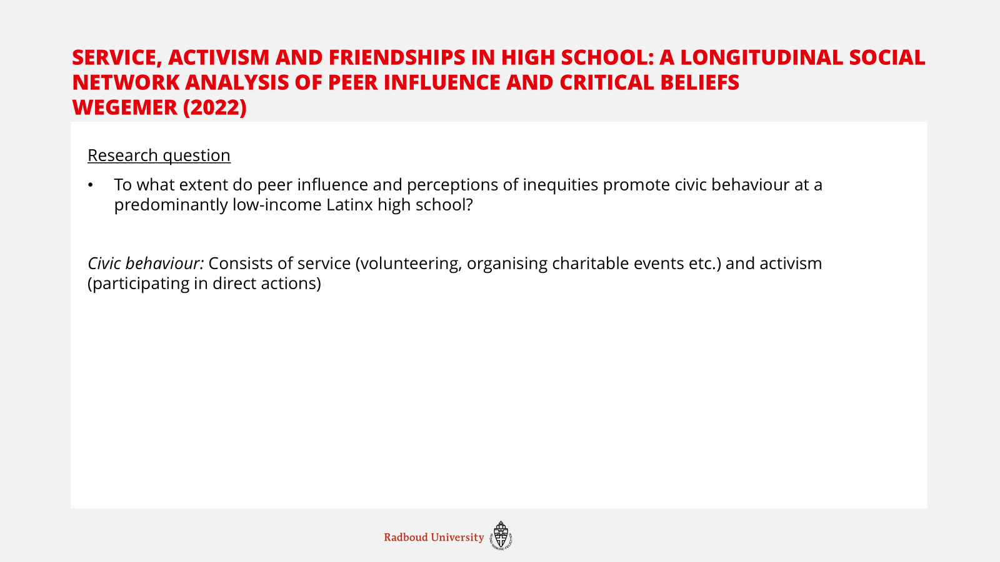
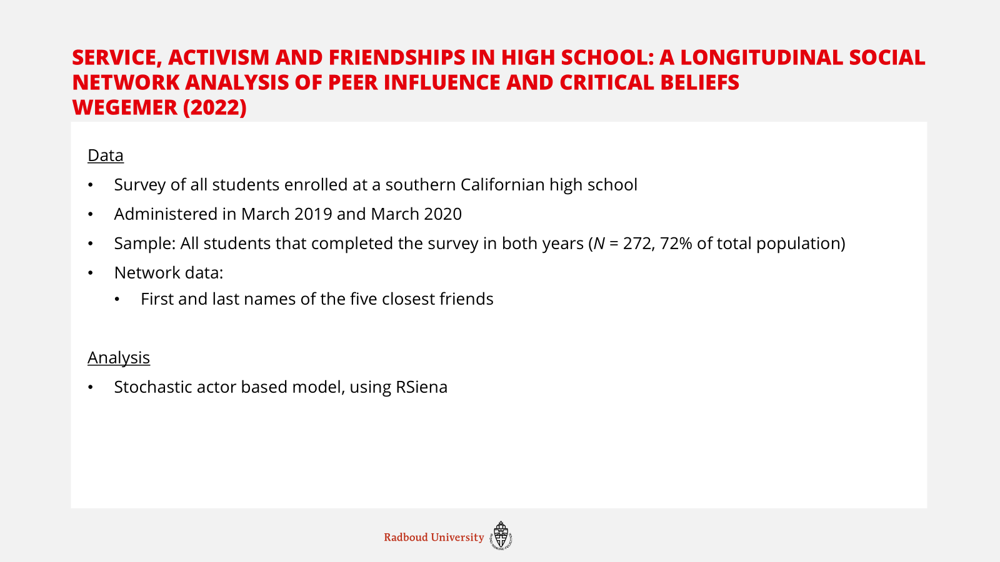
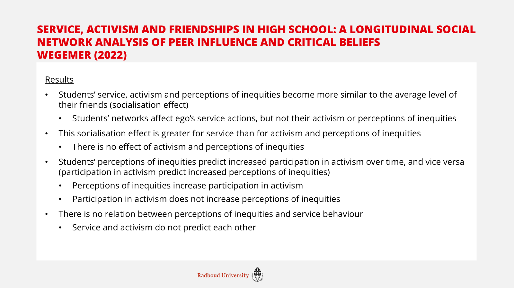
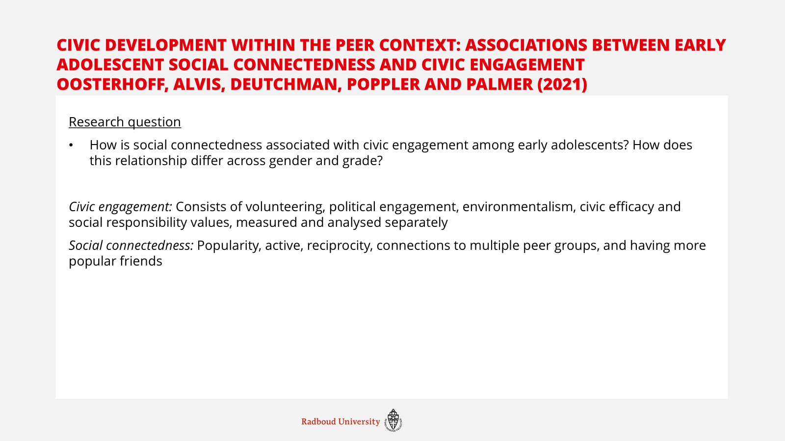
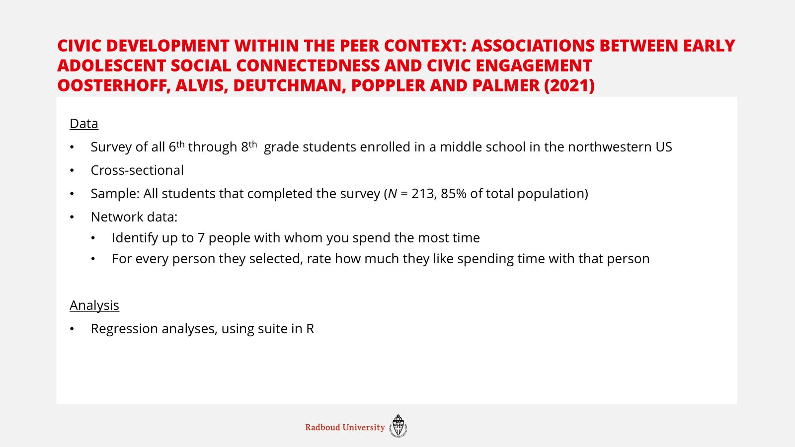
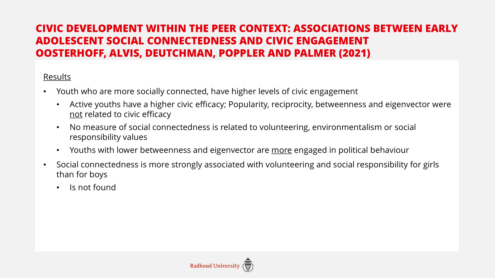
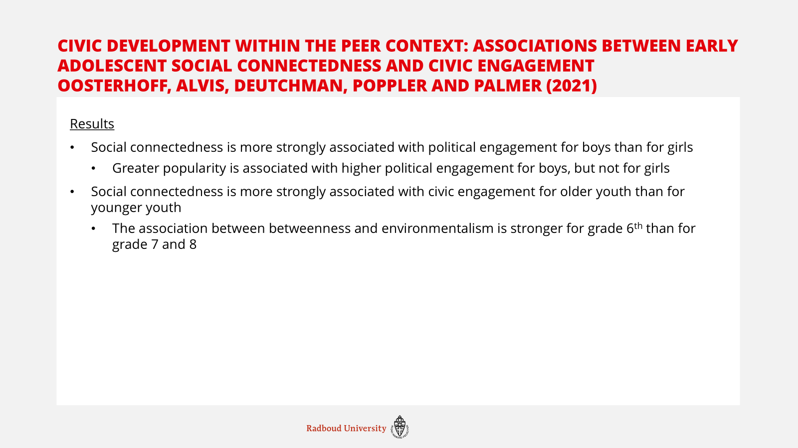
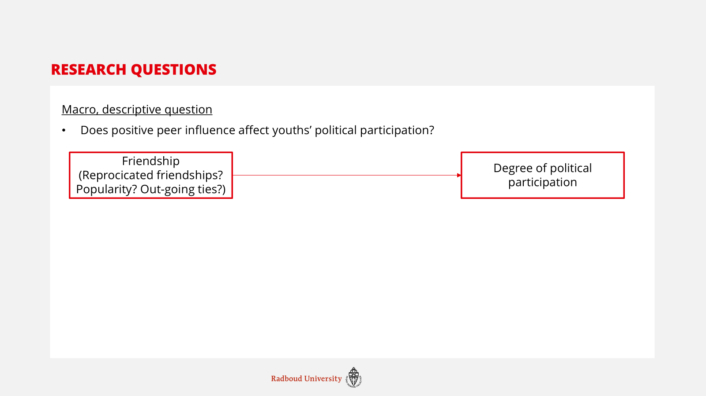
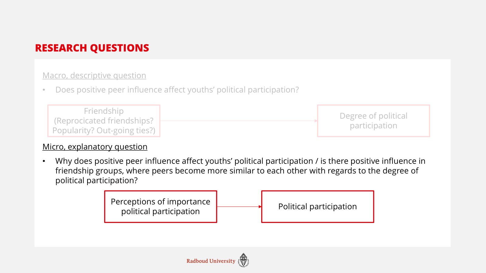
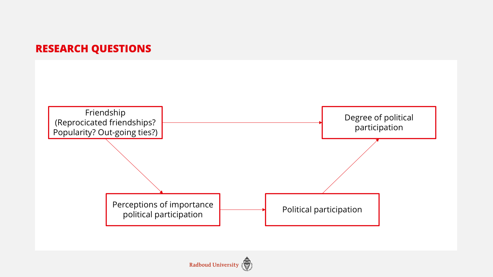

# Preparation before class

Today I will be talking about two papers utilising a social network
perspective with regards to civic participation, and afterwards I have a
short section on my own ideas for research questions.

While both papers are on very similar topics, they operationalise civic
action differently. They also measure networks in different ways.

## Article 1

**Service, activism and friendships in high school: A longitudinal
social network analysis of peer influence and critical beliefs – Wegemer
(2022)**

The first paper I chose is “service, activism and friendships in high
school: A longitudinal social network analysis of peer influence and
critical beliefs” by Wegemer (2022). This paper tries to answer the
question whether peer influence and perceptions of inequities promote
civic behaviour at a predominantly low-income Latinx high school.
Especially the first part of this question is interesting in light of
this course, as for the other one the author does not explicitly use a
social network perspective. But before we get into the methodology,
first a quick explanation of how the author measures civic behaviour.

The author distinguishes between two aspects of civic behaviour: Service
and activism. Service is measured by asking how often the respondents
volunteer or organise charitable events. These are activities that are
explicitly meant to help and build the community. The second aspect is
activism, which is more politically oriented. This is measured by asking
how often the respondents, for example, campaign for specific issues.
The author analyses these two aspects separately.



As for the data, for this paper they collected longitudinal social
network data. The respondents were asked to fill out a survey on two
time points: March 2019 and March 2020. In the end 72% of the students
enrolled at both time points also filled out the survey both times, and
were thus used for this research. In order to collect the network data,
the researcher asked every respondent to give the first and last names
of up to the five closest friends. This way the author created a
socionet of all friendship ties in the school.

For the analysis the author used a stochastic actor based model,
employing RSiena. This was not really explained any further, so I do not
know what this means exactly. But I think that that is what this course
is for.



For this paper I struggled to find the ‘theoretical consequences’ of
using a social network perspective. The paper did not have a very
extensive theory section, and was mostly reporting on previous empirical
findings. While the authors do mention some theory, it is not completely
clear how they deduced the specific hypotheses from this theory.
Nonetheless, in the hypotheses concerning peer influence, there is a
clear social network perspective. The first hypothesis the author tested
was whether students’ become more similar in both their behaviour
(service and activism) and attitudes (perceptions of inequities) to
their peers. Interestingly, only ego’s service behaviour was affected by
a students’ network. The author argues that this is potentially because
of the opportunities that the school offers with regards to service
behaviour, where it is facilitated to start for example volunteering.
This facilitation is not happening for activism behaviour.

This explanation of facilitation by the school is also why the second
hypothesis expected for the socialisation effect to be greater for
service than for activism and perceptions of inequities. As there is no
effect of activism or perceptions, and there is an effect of service,
this is kind of inherently found.

The last two hypotheses don’t take a specific social network
perspective, so I’ll just quickly go through them, as they’re not as
relevant for this course. So I put them, and the results, up on the
screen, but I’ll skip them for now.



## Article 2

**Civic development within the peer context: Associations between early
adolescent social connectedness and civic engagement – Oosterhoff et al
(2021)**

The second article I want to talk about is “civic development within the
peer context: Associations between early adolescent social connectedness
and civic engagement” by Oosterhoff et al (2021). This paper tries to
answer how social connectedness is associated with civic engagement in
early adolescents, and whether this relationship differs across gender
and grade (age). Again, I’ll start by explaining what these authors mean
by civic engagement. They measured and analysed five separate aspects of
civic engagements: (1) volunteering, (2) political engagement, (3)
environmentalism, (4) civic efficacy, and (5) social responsibility
values. Here we can see that there is a slight difference with the
previous paper, where for example volunteering was part of the measure
for service, it is its own category in this paper.

As for social connectedness, the authors again use five measures: (1)
popularity, or how many in coming ties someone has, (2) activeness, or
how many out going ties someone has, (3) reciprocity, or how often an
outgoing tie is met with an in coming tie, (4) betweenness, or with how
many separate peer groups someone is connected and (5) eigenvector, or
how popular your friends are.



As for the data, this paper again looks at school-level data. This time
the authors used a cross-sectional design, where they looked at all
6^th^ through 8^th^ grade students. 85% of all sampled students
responded. The authors provided the respondents with a list of all
students in 6^th^ through 8^th^ grade, and asked them to pick up to
seven people with whom they spend the most time. After that the
respondents were asked to rate how much they like spending time with
that person. Thus, this paper is able to take the kind of relationship
into account, although they only utilise the positive ties with other
people, mirroring the previous article where only friends were seen as
ties.

For the analysis this paper used regression analyses, using suite in R,
which again, I don’t know what that means.



The results of this paper are, as the authors themselves say, quite
‘nuanced’. Because the authors analysed all aspects of social
connectedness and civil engagement separately, there are a lot of
different relations, some of which do have significant results, some of
which don’t. I put the results up on the slides, but I’ll mention the
most important ones.

Youth who mentioned having more ties (active), have a higher civic
efficacy. This was not found for any of the other measures of social
connectedness. Due to the cross-sectional design, it is impossible to
determine whether having more out-going ties leads to higher efficacy,
or the other way around. Interestingly, and contrary to the expectation,
youth who have lower betweenness and eigenvector were more engaged in
political behaviour. As the relationship between any measure of social
connectedness and volunteering/ social responsibility was not found, the
moderation hypothesis that this would be stronger for girls was also not
found. And as you can see there are some measures of social
connectedness that are more strongly related to some measures of civic
engagement for boys than for girls and for younger people than for older
people, but it is only on very specific relationships.





## My own topic

Lastly, I will quickly talk about my own topic. I struggled a little bit
with what I wanted to do, and how I wanted to measure, especially
because I don’t really know what is or isn’t possible with social
network analysis/ within this course. But this is a rough first idea of
what I find interesting.

As an outcome I would be interested to look into political
participation, but I have not yet decided what kind specifically. I
think this depends partly on the dataset, as for example the age matters
a lot for whether you can measure things like voting. At first I wanted
to do something like participation in protests, but I am afraid that
this is too niche for it to really show up in (relatively small-N)
network data. On the macro level, I would thus like to answer how
positive peer influence affects youths’ political participation.



For the micro explanatory question I would like to answer *why* positive
peer influence would affect political participation. Specifically I
would like to see whether youth becomes more similar to each other, if
they are connected. I would especially like to see whether people become
more similar, or whether one person becomes more like the other person.



So this would end up with a conceptual model like this



# During class
```{r}
#install.packages("RSiena")
#install.packages("igraph")
require(RSiena)
require(igraph)
```

Trying to figure out the descriptive statistics of a network data set
```{r}
s501
view(s501)

graph <- graph_from_data_frame(s501)
plot(graph)

graph2 <- graph_from_adjacency_matrix(s501, mode = "undirected")
plot(graph2)

graph3 <- graph_from_adjacency_matrix(s501, mode = "directed")
plot(graph3)

graph4 <- graph_from_adjacency_matrix(s501)
plot(graph4)
```
What we can tell from this, is that there are both directed and undirected ties in this network, visually it seems like there are more undirected ties. 

```{r}
between <- betweenness(
  graph4,
  v = V(graph4),
  directed = TRUE,
  weights = NULL,
  normalized = FALSE,
  cutoff = -1
)

between
plot(between)
```

Looking at macro segregation on drinking behaviour
```{r}
friend.data.w1 <- s501
drink <- s50a

# install.packages("sna")
library("sna")

net1 <- network::as.network(friend.data.w1)
snam1 <- sna::nacf(net1, drink[, 1], type = "moran", neighborhood.type = "out", demean = TRUE)

snam1[2]
view(drink)
```